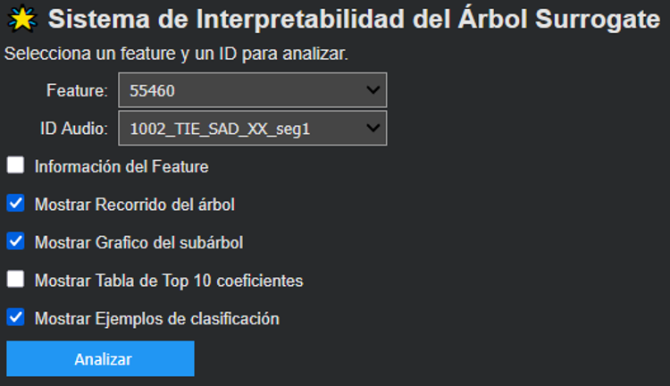
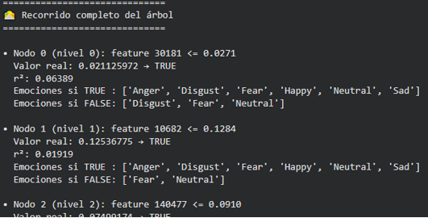
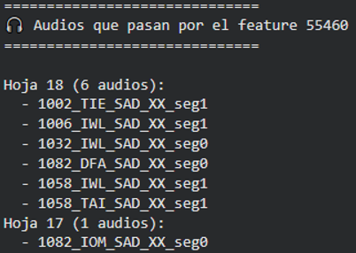
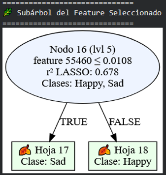
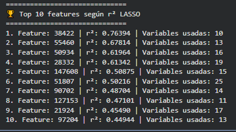
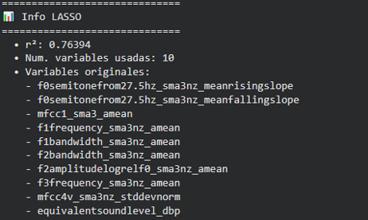

# Detección y Explicación de Patrones Emocionales en la Voz (Escenas de Películas)

Sistema desarrollado para clasificar y explicar patrones emocionales en la voz a partir de escenas de películas, empleando redes neuronales y clasificadores interpretativos.

---

## 🖼️ Vistas Previas del Sistema y Resultados

### 1. Menú Principal e Interfaz de Interpretabilidad

  

### 2. Recorrido del Árbol de Decisión y Análisis de Audios

  
  

### 3. Subárbol Seleccionado

  

### 4. Características Principales y Variables (Lasso / $r^2$)

  
  

---

## 📌 Descripción del Proyecto
Este proyecto analiza clips de audio para identificar características vocales relevantes y relacionarlas con emociones básicas. Utiliza un enfoque híbrido que combina aprendizaje profundo con modelos de interpretabilidad (como árboles de decisión surrogados y selección de variables Lasso) para hacer el proceso transparente y explicable.

## 📂 Estructura del Repositorio
* `Docs/`: Carpeta que contiene los archivos originales de la vista de usuario en rar, la presentación, capturas de pantalla de la interfaz y los gráficos de los resultados.
* `results/`: Archivos CSV con los resultados de la comparación de embeddings y métricas de desempeño.
* `surrogate/`: Modelos entrenados (`.pkl`), reglas del árbol surrogado (`.txt`) y tablas de características relevantes.
